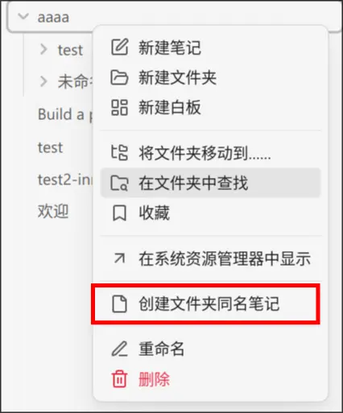
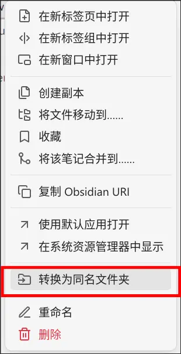
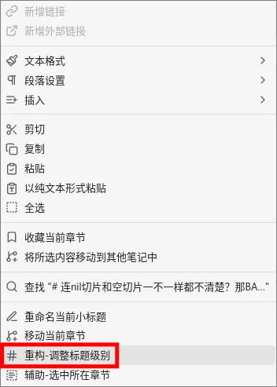
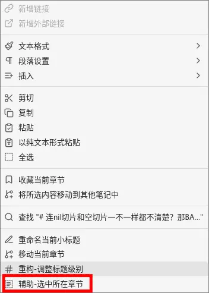
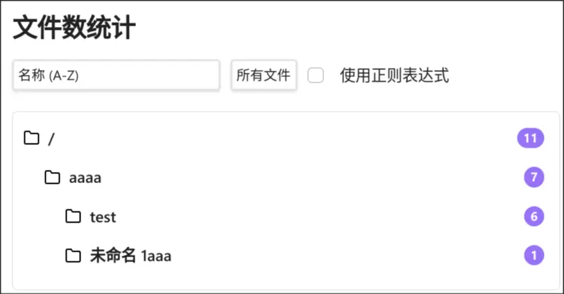
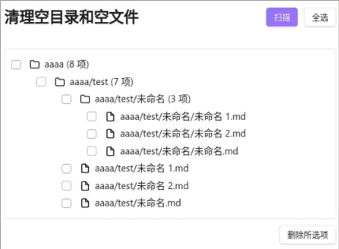
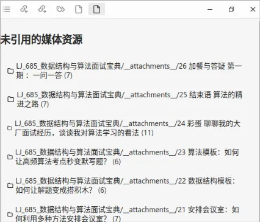
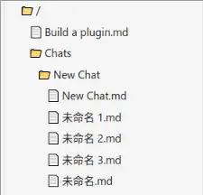

# Obsidian MyNB

## 功能

- 右键文件浏览器
  - 创建文件夹同名笔记
    - 
  - 转换为同名文件夹
    - 
  - 查询有网络图片的笔记
    - 
  - 重构-合并笔记
    - 
- 右键编辑区
  - 调整标题级别
    - 
  - 选中所在章节
    - 
- 命令
  - 文件数统计面板
    - 
  - 清理空文件夹
    - 
  - 查询未引用媒体
    - 
  - 简易文件浏览器替代 (实验性)
    - 

## 安装

### 使用 BRAT

0. 在 Obsidian 中安装 [BRAT 插件](https://github.com/TfTHacker/obsidian42-brat) 并启用
1. 在 BRAT 插件设置中点击 'Add Beta plugin', 填写本仓库地址后点击 'Add Plugin'

## 本地调试

### Linux

0. Clone本仓库安装依赖(`pnpm i`)后, 进入项目目录, 执行 `pnpm run build`
1. 使用 Obsidian 创建一个新的 Vault
2. 在 `<新的 Vault 目录>` 打开终端
3. `ln -s <本项目目录>/output/obsidian-mynb <新的 Vault 目录>/.obsidian/plugins/obsidian-mynb`
4. 重启 Obsidian, 在第三方插件设置中启用插件

## 开发流程

0. 安装依赖 `pnpm i`
1. 修改代码
2. 根据 [本地调试](#本地调试) 中的步骤测试
3. 检查并修改即将发布的版本号, 修改 `package.json` 后运行 `pnpm run version`
4. 提 PR 提交代码
